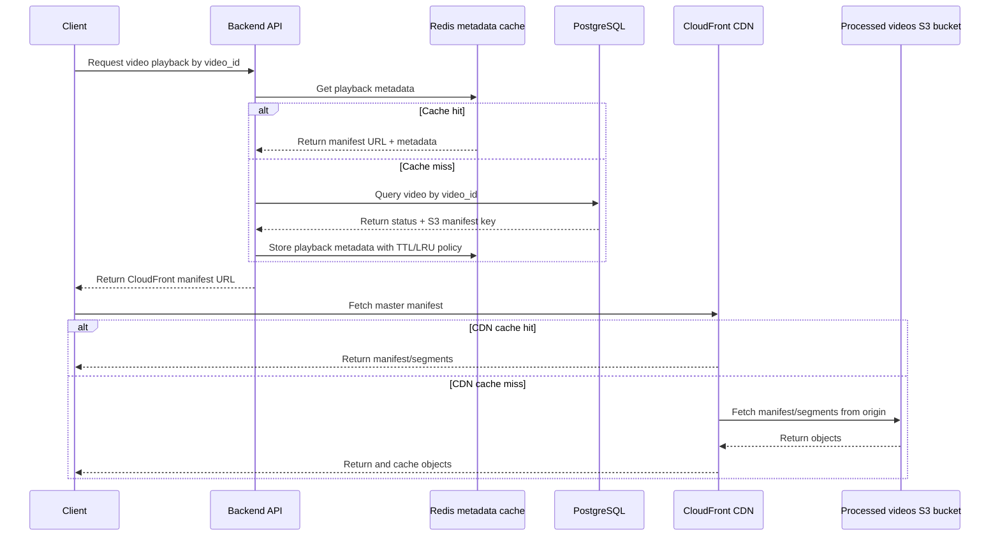

# Video upload & processing architecture
End-to-end pipeline: raw upload → async transcoding → adaptive bitrate streaming


## Pipeline Phases
### Phase 1: Upload
The client first requests a `pre-signed URL` from the backend. Using this URL, the client uploads the raw video file directly to the Raw Videos `S3 bucket`.

#### Why Pre-signed URLs?
Pre-signed URLs allow the client to upload directly to the S3 bucket without needing to authenticate with the backend. They embed temporary `AWS credentials` directly in the URL, valid for up to 7 days.
The elimination of the need for a backend makes the upload process infinitely scalable as no matter how many clients are uploading, the backend is not a bottleneck.

### Phase 2: Event triggering & queuing
After the raw video is uploaded to S3 bucket, S3 fires an event notification directly to an `SQS queue`.
A dedicated `consumer microservice` is available that continuously polls the SQS queue for new events and upon receiving a event, it triggers a transcoding job to be processed asynchronously.

#### Why SQS as a middleman?
We don't trigger the transcoding job directly after the raw video is uploaded to S3 as that's not scalable when there is hundreds of simultaneous uploads.
The queue decouples the upload event from the processing workload. If 10,000 videos are uploaded simultaneously, SQS buffers all 10,000 job messages and processes them asynchronously. The transcoder microservice then processes each job in the queue at its own pace. SQS also guarantees delivery and provides retry semantics if a worker crashes mid-job. Using a FIFO queue adds exactly-once delivery and ordered processing. If a job continously fails, SQS keeps a DLQ (Dead Letter Queue) to capture failed jobs for further investigation.


### Phase 3: Transcoding & Segmentation
The consumer triggers `Amazon ECS` with `Fargate` to spin up a transient Docker container. Inside the container, FFmpeg handles two tasks: transcoding and segmentation. The container is destroyed once the job completes.

>`Transcoding` converts the raw source file into multiple quality renditions/formates — typically 360p, 720p, and 1080p — each at a different bitrate. This is the "bitrate ladder." 

>`Segmentation` splits each rendition into small chunks (≈6 seconds each). These chunks are what the video player actually downloads — it never fetches the full file at once.

- `Fargate` is serverless — AWS manages the underlying EC2 instances. Containers start on-demand and terminate after the job, so you pay per-second for compute only.
- For a 1-hour video at 5 quality levels: ~360 chunks × 5 renditions = 1,800 individual segment files.


### Phase 4: Storage, DB update & retrieval
After `Transcoder` service uploads all the segments and manifest files (FFmpeg generates a manifest file listing all quality variants and their segment URLs) to the `Processed videos S3 bucket`, it then writes the `S3 key` to `PostgreSQL` and updates the video status from in_progress → completed.

#### Retrieval flow with cache + CDN
When a client requests a video, the backend should avoid hitting PostgreSQL for every popular video lookup. A small metadata cache can sit in front of the database:

1. The client requests playback metadata from the `Backend API`, usually by `video_id`.
2. The backend checks `Redis`/`Elasticache` first for popular video metadata, using an LRU-style eviction policy such as `allkeys-lru` or `volatile-lru`.
3. On a cache hit, Redis returns the playback metadata immediately: status, manifest key, playback URL, duration, available qualities, etc.
4. On a cache miss, the backend queries `PostgreSQL`, which remains the source of truth for video records.
5. If the video is completed, the backend builds or fetches the manifest URL, stores the metadata in Redis with a TTL, and returns it to the client.
6. The client loads the HLS/DASH manifest through `CloudFront` instead of directly from S3.
7. The video player reads the manifest, chooses a rendition based on bandwidth/device conditions, and fetches video segments through the CDN.

`Redis` accelerates metadata lookups, while `CloudFront` accelerates delivery of the actual heavy assets: `.m3u8` manifests and `.ts`/`.m4s` segments. PostgreSQL is still the durable source of truth, and S3 is still the origin storage for processed video files.



#### Why add Redis and CloudFront?
- `Redis` reduces repeated database reads for popular videos and keeps playback startup metadata fast.
- `LRU eviction` naturally keeps popular videos hot while removing older or less frequently requested entries when memory fills up.
- `CloudFront` moves video delivery closer to users, reducing latency and preventing S3 from serving every manifest/segment request directly.
- `PostgreSQL` remains the authoritative store, so cache misses and cache invalidation are safe.
- 


### Back-of-envelop calculations (1-hour video, HD 10 Mbps source, 6 s segments)
The core idea behind all of it is one formula: **size = bitrate × time.**

#### Raw File Size
For a 1-hour video recorded at 10 Mbps, the raw file size would be:
```
3,600 s × 10 Mbps = 36,000 megabits
36,000 megabits ÷ 8 (bits per byte) = 4,500 MB = 4.5 GB
```
>Note: Mbps = megabits per second — it's the rate at which the camera is writing data while recording. 10 Mbps means every second of recording, the camera produces 10 megabits worth of video data.
>
>10 Mbps doesn't mean 10 megabits of raw pixels — it means after all the compression, the camera is outputting 10 megabits of compressed data every second. 
Higher bitrate = less compression = better quality (more detail preserved per frame). Lower bitrate = more aggressive compression = smaller file but more visual artifacts.

#### Upload Time
You now have 4.5 GB sitting on someone's device that needs to reach S3. Convert back to bits and divide by the connection speed:
```
4.5 GB = 4,500 MB = 36,000 megabits
36,000 megabits ÷ 100 Mbps = 360 seconds = 6 minutes
```
>Note: 100 Mbps is the assumed upload bandwidth of the user's internet connection — how fast bits can travel from their device to S3.

#### Segment - 1800 files
FFmpeg splits each rendition into 6-second chunks. A 1-hour video gives:
```
3,600 s ÷ 6 s = 600 segments per rendition
600 × 3 renditions = 1,800 segment files
+ 4 manifest files (1 master .m3u8 + one per rendition)
= 1,804 total S3 objects
```

#### Processed Output Size 
The output size has nothing to do with the source bitrate — you're re-encoding to fixed output bitrates regardless of what came in. Each rendition has a defined video bitrate, plus a 128 kbps audio track:
```
360p:  (0.800 + 0.128) Mbps × 3,600 s ÷ 8 = 417 MB
720p:  (2.500 + 0.128) Mbps × 3,600 s ÷ 8 = 1,183 MB
1080p: (5.000 + 0.128) Mbps × 3,600 s ÷ 8 = 2,308 MB
                                         total ≈ 3,908 MB ≈ 3.9 GB
```
>Note: `0.800 + 0.128` — this is the total bitrate for the 360p rendition. The 0.800 Mbps is the video track (the pixels). The 0.128 Mbps is the audio track (the sound).
The bitrate numbers - 0.8000, 2.5000, 5.0000 Mbps are industry standard numbers.
In a real system, this bitrate ladder is something you explicitly configure in your FFmpeg command:
```
ffmpeg -i input.mp4 \
  -vf scale=640:360  -b:v 800k  -b:a 128k output_360p.m3u8 \
  -vf scale=1280:720 -b:v 2500k -b:a 128k output_720p.m3u8 \
  -vf scale=1920:1080 -b:v 5000k -b:a 128k output_1080p.m3u8
```


#### Transcode Time
Fmpeg encodes all 3 renditions simultaneously using output maps, so the time is determined by the slowest one — which is 1080p. On a 2 vCPU Fargate container running H.264 software encoding, 1080p runs at roughly 1× realtime. So a 60-minute video takes about 60 minutes to transcode.

#### Fargate Cost
On AWS Fargate, the cost is based on the number of vCPUs and memory used.
```
CPU:  2 vCPU × $0.04048/hr × 1 hr = $0.081
RAM:  4 GB   × $0.004445/hr × 1 hr = $0.018
                                   = $0.099 ≈ $0.10
```

#### S3 Storage
S3 charges $0.023 per GB per month. The video sits in both buckets:
```
Raw:       4.5 GB × $0.023 = $0.10/month
Processed: 3.9 GB × $0.023 = $0.09/month
                           = $0.19/month total
```
